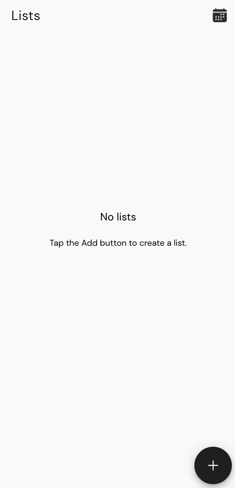
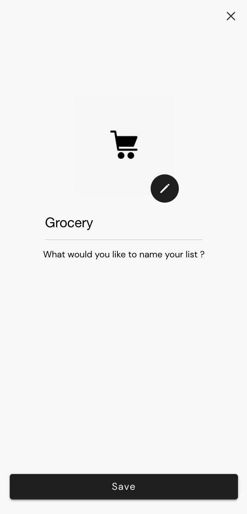
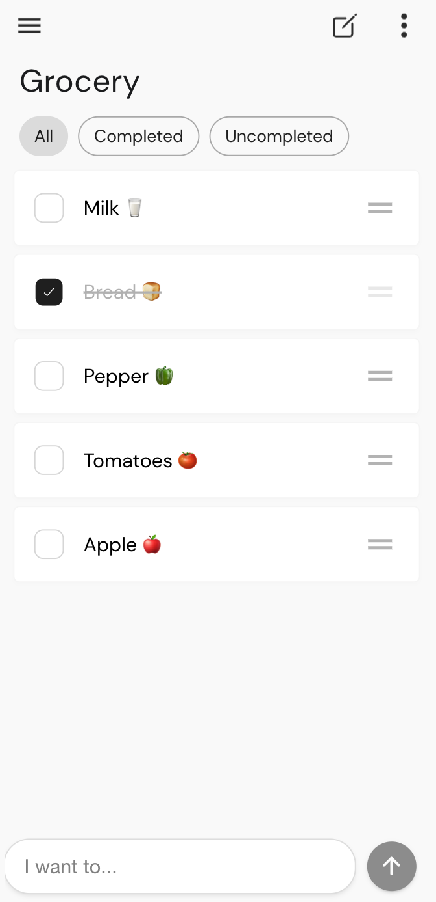
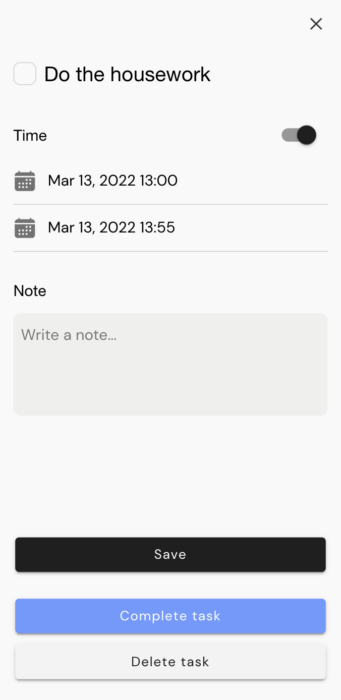
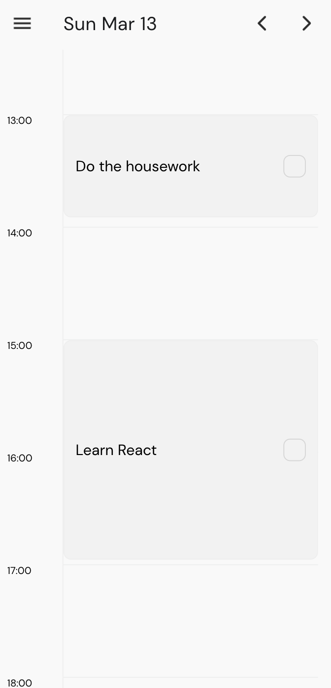

# Lists
 Lists as a cross plateform application used to organize lists and notes. It was built using Ionic framework

 # How to install

After cloning the project repo and in order to launch the app, go the root folder and then launch the following commands :

```
lists> npm install -g @ionic/cli 
lists> npm run install
lists> ionic serve
```
then, open your browser (http://localhost:8100)


 # Screens
   

  